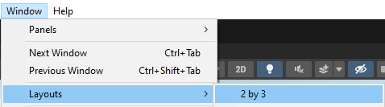

# VR_Class

 Students will learn the basics of game development and Virtual Reality by creating a game! This course will cover topics such as game engines, 3D space, art assets, and an introduction to coding. We will bring it all together to create a game in virtual reality. No programming experience is necessary but participants need a general familiarity with computers and using software.

# Cirriculum

## Session 1: Overview
VR Safety, Intro To Unity (Position, Rotation Scale), Build A Snowman

### VR Safety

https://www.youtube.com/watch?v=Ke4MefpmRmc&ab_channel=MetaQuest

If any student feels dizzy
- Take off the headset
- Take a seat
- Grab a water and or snack

Teacher notes
- Ensure snacks and water are readily available
- Keep an eye out for off balance students
- Know where the nursing program is in case medical attention is required

#### Creating A Safe Stationary Boundry

No Room Scale boundaries are allowed in this class.

https://youtu.be/zh5ldprM5Mg?si=aGCoaAT2xltc8pwq

*Excercise: Practice setting up a new boundary*

Have the students:
- Disconnect the Link Cable from the headset
- Put on the wrist straps and headset 'welder style' resting on their forehead
- Walk across the room, outside their previously set up boundary
- Set up a stationary boundary
- Walk back to their original station, 
- Ensure each student is at least arms reach away from
- - Their desk
- - Other students. This may require stagering their chair positons for safe distance
- Set up another stationary boundary near their station

Purpose: Help the students get comfortable with this process of setting up a safe boundary

#### Coiling Cords

A simple circle coil with enough space on either end to reach the computer and headset, velcroing the circle closed. This is covered in the first 30 seconds of this video:
https://youtu.be/PeLrxXUbq0g?si=doWgMNpqIP_2NphR

### Intro To Unity

Have the students open the NUAC_VR_Class Project in Unity. The layout used in this class is 2 by 3.

#### Unity Layout

https://learn.unity.com/tutorial/explore-the-unity-editor-1#6273f00fedbc2a7f158cc1ee

#### Position, Rotation, Scale

https://docs.unity3d.com/Manual/class-Transform.html

#### Build a Snowman

Using position, rotation, and scale, make 3 spheres on top of each other. The smallest on top, the largest on the bottom.

Extra Challenges:
- Add a Hat
- Add a face
- Add color: https://youtube.com/shorts/mJ2y-eNDTxY?si=_dYi70ktqydniQac

## Session 2: Living Room 1: Build a Living Room
Using Unity's Create With VR project, we are going to design a living room.

## Session 3: Living Room 2: Import Assets Into The Living Room
Student's continue to build our their living rooms. They now download assets form the Unity Asset Store* and import them into the project.

## Session 5: Coding
Students will review two scripts and write thier own. the result is a button that makes an explosion.

## Session 6: Block Slicer 1: Import A Song
Students will be introduced to Block Slicer project. They can choose a song on youtube*, convert it to mp3, and import it into the project.

## Session 7: Block Slicer 2: Import Assets
Students continue the Block Slicer project, adding assets into the game to fit their theme.

## Session 8: Block Slicer Finale: Shocase
The first half of the project is wrapping up the game. The second half is testing and providing feedback to each other's games.

*Any and all contant that is imported into our projects will be 'class appropriate / PG'. If a student is unsure if content is fits that category, teacher is encouraged to make a judgement call.

 
